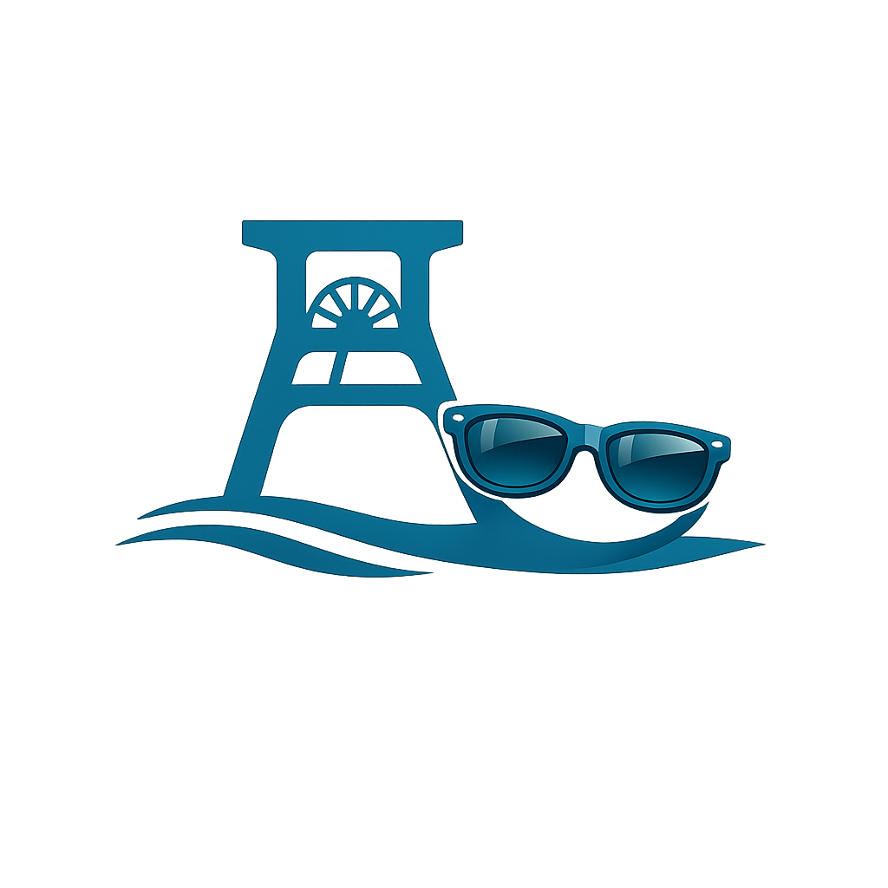
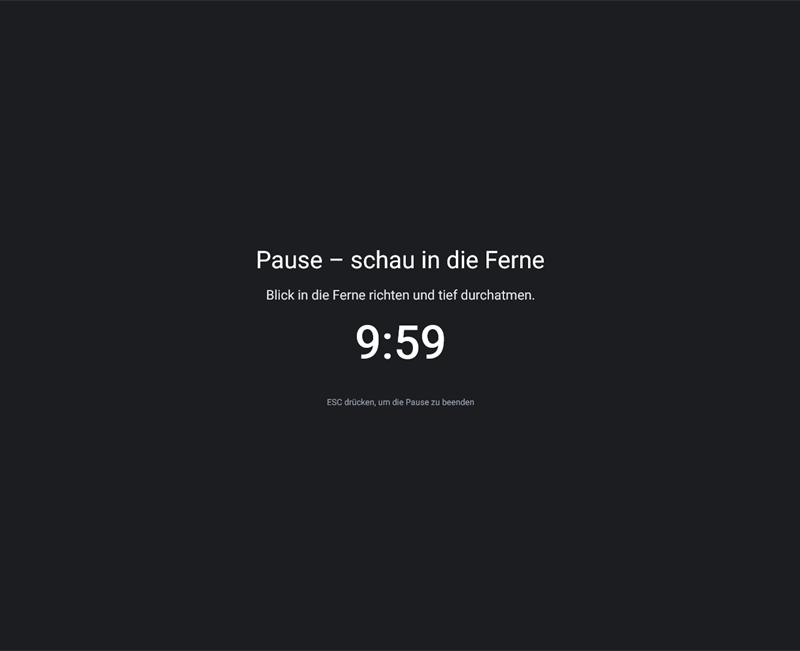
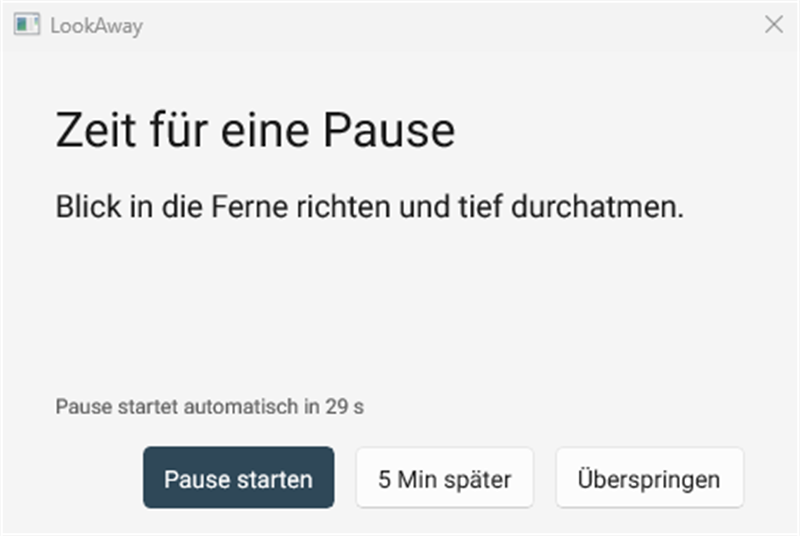
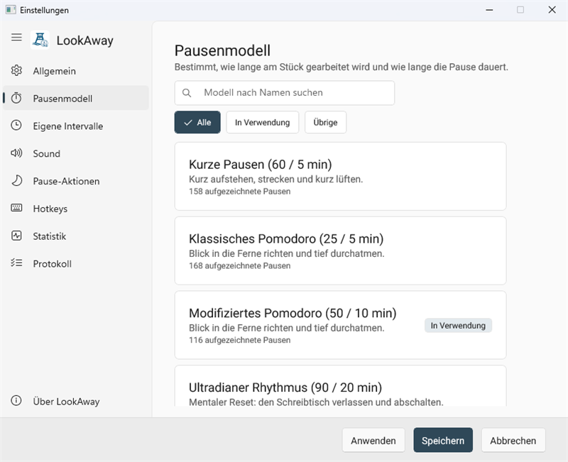
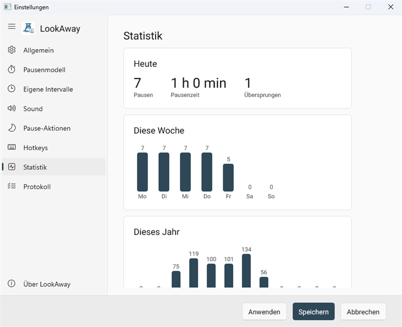
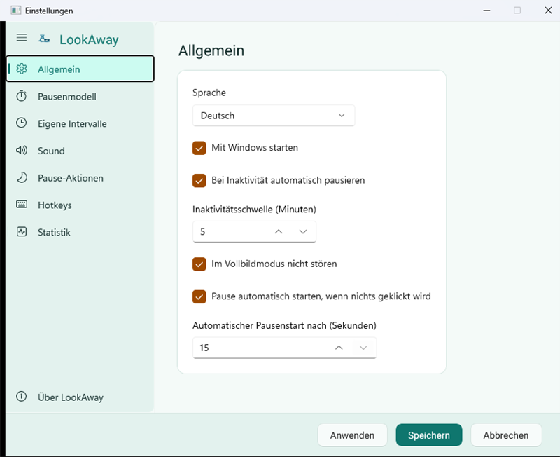
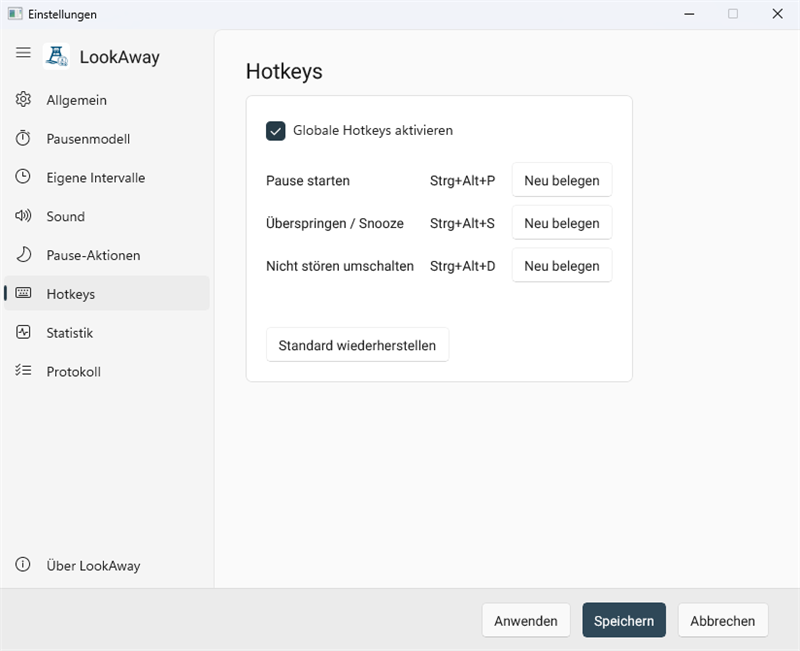

<div align="center">



# LookAway

**Des pauses d'écran, rappelées intelligemment.**

[](https://github.com/ReneSchustek/LookAway/actions/workflows/ci.yml)
[](https://github.com/ReneSchustek/LookAway/releases/latest)

[Deutsch](README.md) · [English](README.en.md) · **Français**

</div>

LookAway est une application Windows légère, logée dans la zone de notification, qui rappelle
discrètement de faire des pauses d'écran. Elle tourne sans déranger en arrière-plan, propose plusieurs
modèles de pause fondés scientifiquement et se configure entièrement par utilisateur Windows — pour
toutes celles et ceux qui travaillent beaucoup à l'écran et veulent préserver leurs yeux, leur posture
et leur concentration.

## Version actuelle

**[v1.4.1](https://github.com/ReneSchustek/LookAway/releases/latest)** est la version actuelle –
disponible en Setup.exe et en ZIP portable. Points forts des versions les plus récentes :

- **La surimpression de pause se place de façon fiable au-dessus de tout** – sur chaque moniteur,
  jusqu'au dernier pixel et sans entrée dans la barre des tâches ni dans Alt-Tab.
  **Ctrl + Alt + S** met fin à une pause en cours.
- **Apparence claire et sombre** – au choix ou selon le réglage de Windows ; le choix prend effet
  immédiatement dans la fenêtre ouverte.
- **Tâches (modèle basé sur les tâches)** – les tâches en cours, avec recherche et filtres ;
  chaque pause est rattachée à la tâche en cours
- **Journal dans l'application** – les dernières entrées avec recherche et filtres par niveau et
  période. Jusqu'ici elles n'existaient que sous forme de fichier dans le dossier de données.
- **Modèles de pause en cartes** – avec champ de recherche et filtres ; chaque carte indique quoi
  faire pendant cette pause et combien de pauses en sont issues.
- **Mises à jour signées** – chaque paquet est vérifié avant son installation contre une signature
  ECDSA P-256 et refusé sans signature valide.
- **Installation en un clic** – « Rechercher des mises à jour » installe directement le paquet trouvé,
  sans détour par la page des versions.

## Fonctionnalités

- **7 modèles de pause** – Pomodoro, Pomodoro modifié, rythme ultradien, Physical Counter,
  pauses courtes, basé sur les tâches et la recommandation légale
- **Pause automatique et Ne pas déranger** – met en pause en cas d'inactivité et supprime les rappels
  pendant les applications plein écran (présentations, films, jeux)
- **Réinitialisation après une absence** – après une mise en veille ou une longue inactivité (p. ex. un
  appel), le minuteur de travail redémarre à zéro, les yeux s'étant déjà reposés
- **Écran de pause assombri** – une surimpression plein écran apaisante masque l'écran pendant la
  pause, affiche le compte à rebours et l'objectif d'exercice, et se ferme à tout moment avec
  **ÉCHAP** ; en option sur **tous les moniteurs** et dans une **couleur librement choisie**. Elle se
  place au-dessus de toutes les fenêtres et de la barre des tâches et n'apparaît ni dans la barre
  des tâches ni dans le sélecteur Alt-Tab
- **Actions de pause** – assombrir l'écran (DDC/CI) et mettre en pause la lecture multimédia
  (uniquement les lecteurs intégrés aux commandes multimédias de Windows comme Spotify, l'application Musique, Chrome/Edge/Firefox ; VLC n'est pas pris en charge)
- **Mises à jour automatiques** – vérification optionnelle via l'API des versions GitHub ; sur demande,
  LookAway télécharge et installe lui-même les nouvelles versions (voir [Mises à jour](#mises-à-jour))
- **Apparence claire et sombre** – au choix ou selon le réglage de Windows
- **Trilingue** – allemand, anglais, français, commutable à chaud
- **Statistiques et export CSV** – pauses par jour, semaine et année, exportables
- **Journal dans l'application** – les dernières entrées avec recherche et filtres par niveau et
  période ; utile lorsque quelque chose ne fonctionne pas comme prévu
- **Raccourcis globaux** – démarrer une pause, ignorer, basculer Ne pas déranger – depuis partout
- **Son optionnel** – un signal discret lors du rappel (au choix parmi trois sons)
- **Démarrage automatique** – démarre au besoin automatiquement avec Windows

## Prérequis

- Windows 10 (version 1809) ou plus récent / Windows 11

## Installation

L'application prête à l'emploi est publiée en deux variantes sur la
[page des versions](https://github.com/ReneSchustek/LookAway/releases/latest) : un **Setup.exe** et un
**ZIP portable**.

### Setup.exe

1. Téléchargez `LookAway-Setup-<version>.exe` et exécutez-le.
2. L'installateur demande le dossier cible, l'entrée au menu Démarrer et le démarrage automatique en
   option. La désinstallation passe par « Applications et fonctionnalités ».

### Portable

1. Téléchargez `LookAway-Portable-<version>.zip` depuis la page des versions et décompressez-le dans un
   dossier quelconque.
2. Lancez `LookAway.exe`. En mode portable, toutes les données se trouvent à côté de l'EXE – idéal pour
   une clé USB.

> Remarque : les builds ne sont pas signés avec un certificat d'autorité – Windows SmartScreen peut
> avertir au premier lancement (« Informations complémentaires » → « Exécuter quand même »). Le texte de
> la version indique le SHA-256 de chaque fichier, ce qui permet de vérifier un téléchargement avant de
> l'exécuter : `Get-FileHash .\LookAway-Setup-<version>.exe -Algorithm SHA256`.

### Compiler soi-même

Les deux artefacts se génèrent aussi localement, ainsi qu'un **paquet MSIX** qui n'est pas publié :

```powershell
# Dossier du programme ET Setup.exe pour la distribution (nécessite Inno Setup) :
tools\publish.ps1

# ZIP portable :
tools\publish-portable.ps1 -Version <version>

# Setup.exe (nécessite Inno Setup) :
tools\publish-setup.ps1 -Version <version>

# Paquet MSIX :
msbuild src\LookAway.App\LookAway.App.csproj -p:Configuration=Release -p:Platform=x64 `
  -p:WindowsPackageType=MSIX -p:GenerateAppxPackageOnBuild=true
```

## Premiers pas

Au premier lancement, un court assistant en trois étapes guide la configuration : langue, modèle de
pause et démarrage automatique. Ensuite, LookAway vit dans la zone de notification – un clic sur
l'icône ouvre le menu, un double-clic ouvre les paramètres.

## Configuration

Toutes les options se trouvent dans la fenêtre des paramètres (menu de la zone de notification →
« Paramètres… ») dans le menu latéral repliable : général (avec l'apparence), modèle de pause,
intervalles personnalisés, son, pause (avec assombrissement et sélecteur de couleur), raccourcis,
statistiques, journal et À propos (avec les options de mise à jour).

Les modèles de pause se présentent sous forme de cartes avec un champ de recherche et des filtres :
chacune indique quoi faire pendant cette pause et combien de pauses en sont issues. Un clic
sélectionne le modèle.

## Mises à jour

LookAway peut se maintenir à jour tout seul :

- Lorsque la vérification est active et qu'une nouvelle version est disponible, l'entrée « Update »
  apparaît dans la zone de notification.
- Un clic télécharge le nouveau ZIP portable, remplace les fichiers du programme après la fermeture et
  redémarre.
- Avec l'option **« Mettre à jour automatiquement »**, cela se fait en arrière-plan et s'applique au
  prochain démarrage, sans intervention.
- Avant l'application, la version et le SHA-256 du fichier téléchargé sont vérifiés ; le téléchargement
  se fait uniquement via HTTPS depuis GitHub. Le remplacement automatique fonctionne pour les
  installations portables et par utilisateur (pour « tous les utilisateurs », LookAway ouvre plutôt la
  page de version).

## Modèles de pause

| Modèle | Travail | Pause | Recommandé pour |
|---|---|---|---|
| Pauses courtes | 60 min | 5 min | Longues phases de travail calmes |
| Pomodoro classique | 25 min | 5 min | Travail concentré par étapes |
| Pomodoro modifié | 50 min | 10 min | Blocs de concentration plus longs |
| Rythme ultradien | 90 min | 20 min | Travail profond selon le rythme naturel |
| Physical Counter | 40 min | 2 min | Posture et micro-pauses |
| Basé sur les tâches | jusqu'à 120 min | 10 min | Travailler jusqu'à un jalon |
| Recommandation légale | 120 min | 15 min | Travail sur écran selon la réglementation |

## Raccourcis (par défaut)

| Action | Combinaison de touches |
|---|---|
| Démarrer une pause | `Ctrl + Alt + P` |
| Ignorer / Reporter | `Ctrl + Alt + S` |
| Basculer Ne pas déranger | `Ctrl + Alt + D` |

Les raccourcis peuvent être activés dans les paramètres ou réinitialisés à leurs valeurs par défaut.

Si une pause est en cours, « Ignorer / Reporter » y met fin — le deuxième moyen, à côté d'**ÉCHAP**,
de quitter la surimpression plein écran.

## Confidentialité

LookAway est sobre en données et fonctionne entièrement en local :

- **Ce qui est enregistré :** paramètres, historique des pauses et fichiers journaux – exclusivement
  sur votre propre appareil sous `%APPDATA%\LookAway` (ou à côté de l'EXE en mode portable).
- **Ce qui n'arrive pas :** aucune donnée d'utilisation, aucune télémétrie et aucune donnée
  personnelle ne sont envoyées à un serveur.
- **Seule connexion réseau :** la vérification de mise à jour optionnelle interroge l'API publique des
  versions GitHub pour savoir si une version plus récente existe. Elle peut être désactivée dans les
  paramètres.

## Captures d'écran



*L'écran de pause – recouvre l'écran, affiche l'objectif et un compte à rebours, se ferme avec **ÉCHAP**.*



*Le rappel – démarrer, reporter ou ignorer la pause ; sans clic, elle démarre d'elle-même.*



*Modèles de pause – en cartes avec recherche et filtres ; chacune indique quoi faire pendant la pause.*



*Statistiques – pauses par jour, semaine et année, exportables en CSV.*



*Paramètres – apparence, langue, démarrage automatique et pause automatique.*



*Raccourcis globaux – chaque action peut être réattribuée à votre propre combinaison via « Neu belegen ».*

Les captures montrent l'interface en allemand. D'autres captures sont rassemblées sous
[`docs/screenshots/`](docs/screenshots/).

## Journal des modifications

L'historique des versions est dans [`CHANGELOG.md`](CHANGELOG.md).

## Pour les développeurs

L'architecture, la compilation, les tests et les détails internes sont décrits dans
[`docs/DEVELOPMENT.md`](docs/DEVELOPMENT.md).

## Licence

Licence MIT – voir [LICENSE](LICENSE).

La police **Roboto** fournie avec l'application est sous licence Apache 2.0 ; le texte de la
licence se trouve à côté des fichiers de police, dans `src/LookAway.App/Assets/Fonts/LICENSE.txt`.
